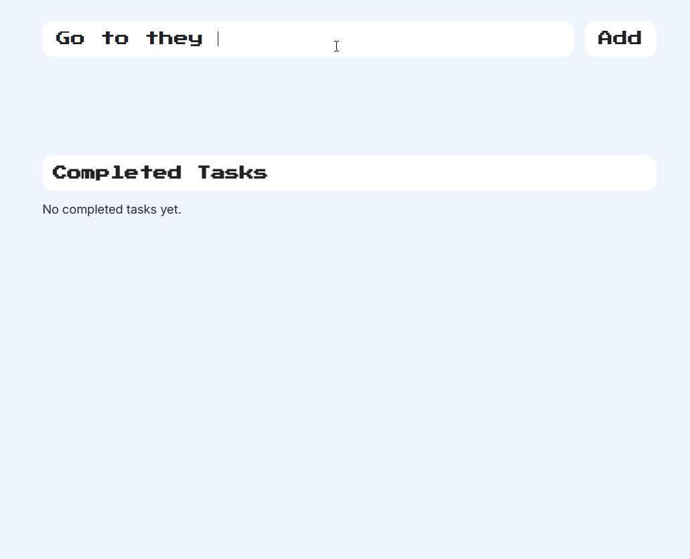

# To-Do List using ReactJS + Vite

User is able to:
  1. Create new tasks
  2. Update/Mark tasks as completed.
  3. Delete tasks from both the completed and incomplete sections.
  4. Undo a task's completion status and move it back to the incomplete section.
     
Credits to this tutorial by Smoljames https://github.com/jamezmca  
Link: https://www.youtube.com/watch?v=82PXenL4MGg&t=2601s
